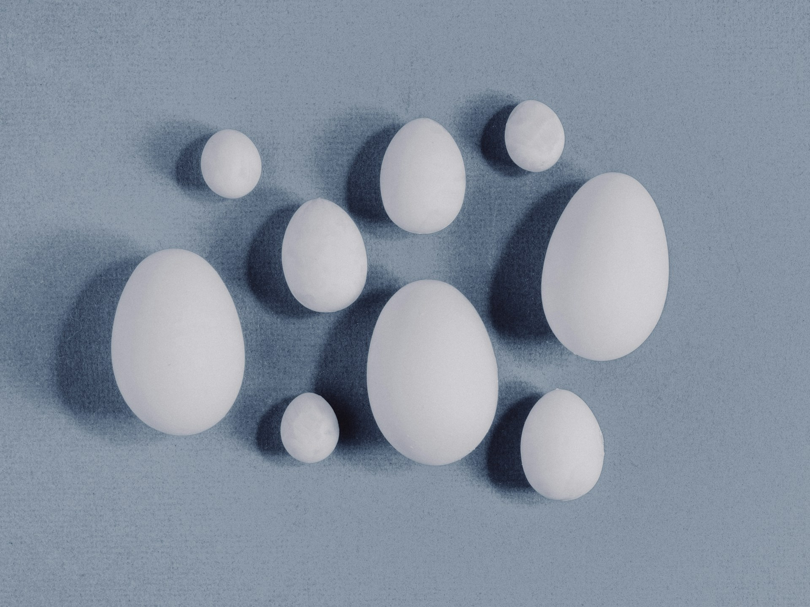

## Conteúdo

<i class="fas fa-fire"></i> Básico

<h5 class="card-title">Tamanho de Efeitos</h5>

<a href="tutorial-metanalise-effectsize.html" class="card-btn">
Acessar Aula <i class="fas fa-arrow-right"></i>
</a>

<i class="fas fa-chart-bar"></i> Intermediário

<h5 class="card-title">Modelos de Pooling</h5>

<a href="construcao.html" class="card-btn">
Acessar Aula <i class="fas fa-arrow-right"></i>
</a>

<i class="fas fa-chart-bar"></i> Intermediário

<h5 class="card-title">Heterogeneidade</h5>

<a href="construcao.html" class="card-btn">
Acessar Aula <i class="fas fa-arrow-right"></i>
</a>

